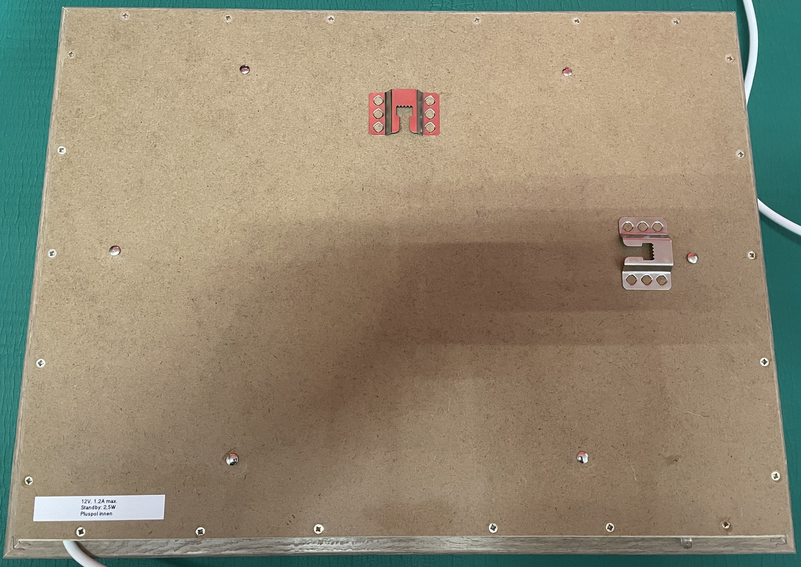

# WiFi pictureframe
## Description
A WiFi pictureframe with cloud sync, Raspberry Pi 4, recycled laptop LCD with LED backlight modification, motion sensor and ambient light sensor, MQTT App control

## Software
Mostly based upon the great work of Wolfgang Männel (https://www.thedigitalpictureframe.com) and the guys behind [Pi3d](https://github.com/pi3d).
Combined with [Rclone](https://rclone.org/) for syncing the picture files from Onedrive to the Pi.
My part is a small python script running as a service which is controlling the utility functions like dimming and power saving: https://github.com/gituser-rk/scriptcollection/blob/main/blank_hdmi.py

-Raspberry Pi OS

-Rclone

-Pi3d

-MQTT Broker

-Enable I2C in raspi-config

-blank_hdmi.py

## Guts

I had laying around a old Laptop with a 14 inch 1280x800 pixel display with a CCFL backlight. At Aliexpress I found an interface board for converting the LVDS connection to HDMI.
And I removed the old CCFL backlight and installed a LED backlight instead.

### Power saving considerations
Because it makes no sense that the pictureframe is switched on all the time (at night or nobody is in the room) I decided to implement a power saving function. 
My first intention was to simply switch off the HDMI signal with the command "subprocess.call('vcgencmd display_power 0',shell=True)" in Python, depending on presence. That's where the name of the program "blank_hdmi.py" is sourced. I'm using a cheap "HFS-DC06H" Radar sensor board from China.

It can be powered by 3.3, 5 or even more Volts and has an output with a relative short "On" time of 2 seconds minimal (adjustable to max. 120 seconds). And the sensitivity is also adjustable.

The Raspberry Pi 4 is drawing around 4-5 Watts and the display board including the LCD and backlight another 7 to 8 Watts when displaying pictures (full brightness).
When switching off the HDMI output, the Pi stays at 4-4.5 Watts and the display part at 1-1.5 Watts.
What I've discovered as I switched off the power supply for the display parts was that the Pi dropped his wattage to 2.5 Watts! Whether the HDMI blank signal was send or not.
So finally I've removed the command "subprocess.call('vcgencmd display_power 0',shell=True)" from the script but used a GPIO pin of the Pi to switch off the display parts with an MOSFET/Relay board.

#### MOSFET/Relay board
I had this laying around. Originally it was a pure N-channel MOSFET board which can handle 15 Amps of current and this is more than enough to switch the display parts. But after connecting the HDMI cable to the Pi I've discovered that the HDMI driver board powered off no more. The reason: The MOSFET board switches off the negative, but this is still connected via the HDMI cable (ground/shielding). The solution would be a P-channel MOSFET which I not had, but a 12V relay. So I've added this to the board and it works.

#### Ambient light sensor
This is a TLS2561 based I2C ambient light sensor. It is mounted on the inside and the light passes a plastic light guide from outside to the inside.

#### LCD backlight brightness control
The LED driver board has a "standarized" "ADJ" labeled pin which can be used for brigtness control via pulse width modulation (PWM).
A level shifter is used to convert the 3.3V logic of the Pi GPIO pins to the 5V logic of the LED driver board.

